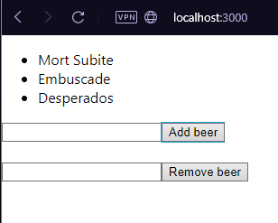
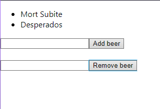

# Compte-rendu TP React

Auteurs: Gentile Brian & Gombert Gwenael


## 1. Setup du projet

### Requirements:

nodeJs(version utilisée: 16.19.1)
npm(version utilisée: 8.19.3)

L'application doit sûrement pouvoir se lancer avec une version plus récente mais si jamais cela ne fonctionne pas, utilisez la version que nous avons utilisé.
Vous pouvez pour cela utilisé nvm sous Linux ou nvm-windows sous Windows qui est disponible sur github: https://github.com/coreybutler/nvm-windows

### Lancement du projet

Cloner le projet puis mettez vous dans ce dernier.

```bash
$ git clone https://github.com/BrianGentile/tpReact.git

$ cd tpReact
```

Lancer ensuite cette commande:
```bash
$ npm install
```
puis lancer le projet:
```bash
$ npm run start
```
L'application est accessible depuis un navigateur à l'adresse "localhost:3000"


## 2. Fonctionnement de l'application

Vous avez 2 champs de saisie: l'un pour ajouter une bière et l'autre pour en enlever une.
Faites attention à ne pas faire de faute de frappe quand vous voulez enlever car il faut le nom exact de la bière.

exemple:

On ajoute 3 bières:



On en enlève une:


